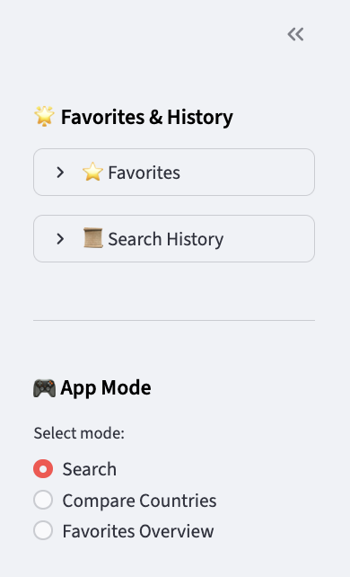
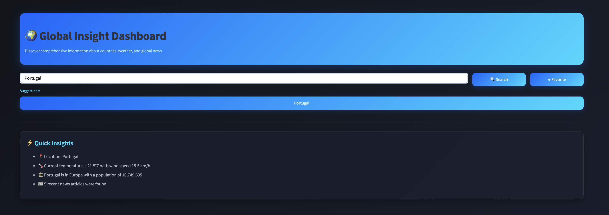
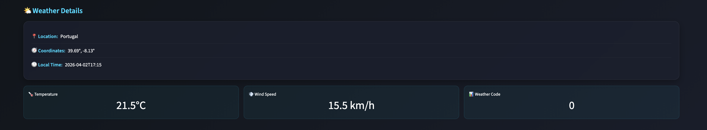
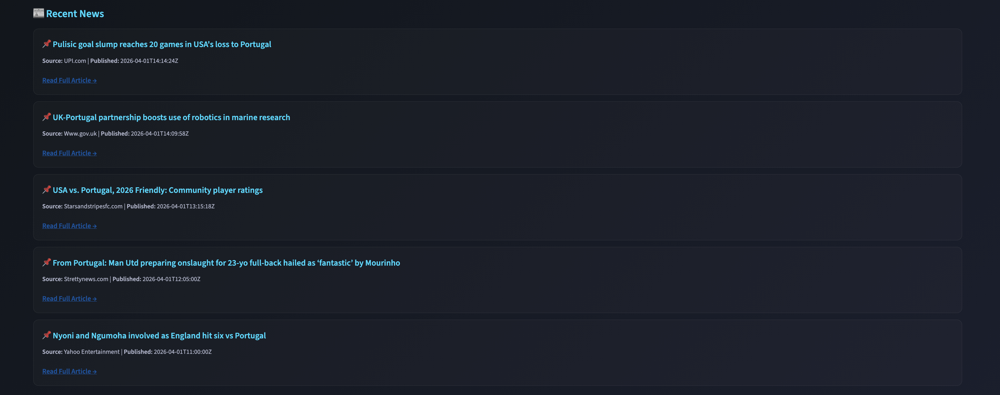
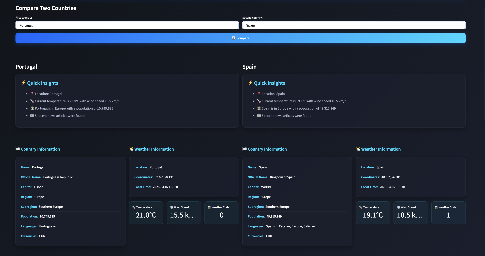
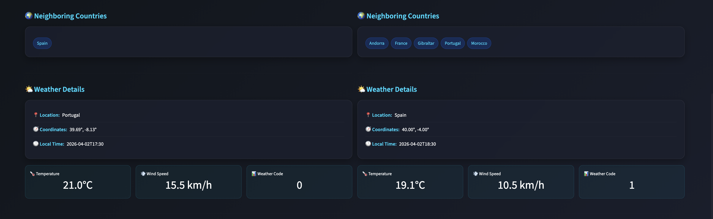
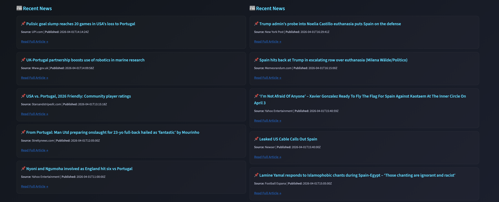

# 🌍 Global Insight Dashboard

Global Insight Dashboard is a Python Streamlit application that lets users explore country-level information, compare two countries side by side, view live weather conditions, interact with map-based location context, and browse recent news in one interactive dashboard.

This project combines multiple real-world APIs into a polished interactive dashboard where users can search for a country, compare two countries side by side, monitor live weather, explore map context, and track country-related news.

## Live Demo

[Open the app](https://global-insight-dashboard.streamlit.app/)

[](https://global-insight-dashboard.streamlit.app/)

---

## Features

- Search for a country and view key national information
- Compare two countries side by side
- Display official country details such as capital, region, population, language, and currency
- Show the national flag
- Visualize the location on an interactive map
- Display live weather metrics including temperature, wind speed, and weather code
- Browse recent country-related news articles
- Save favorite countries
- Track search history
- View quick insight summaries generated from returned data
- Use a polished multi-section dashboard layout for exploration

---

## App Screenshots

### Sidebar: Favorites / History


### Home / Search View


### Country Information and Map


### Weather Details


### Recent News


### Compare Countries Mode


### Compare Countries Details


### Compare Countries News


---

## Tech Stack

- **Python**
- **Streamlit**
- **REST Countries API**
- **Open-Meteo API**
- **NewsAPI**
- **Pandas**
- **Requests**
- **Python-dotenv**
- **Folium**
- **Streamlit-Folium**
- **Pytest**
- **GitHub Actions**

---

## APIs Used

### REST Countries API
Used for:
- country name
- official name
- capital
- region
- subregion
- population
- languages
- currencies
- flag
- neighboring countries

### Open-Meteo API
Used for:
- location geocoding
- coordinates
- current weather data

### NewsAPI
Used for:
- recent news headlines related to searched countries

---

## Project Structure

```text
global-insight-dashboard/
│
├── src/
│   ├── api_clients/
│   │   ├── countries.py
│   │   ├── weather.py
│   │   └── news.py
│   ├── __init__.py
│   └── api_clients/__init__.py
│
├── tests/
│   ├── conftest.py
│   ├── test_smoke.py
│   ├── test_countries.py
│   ├── test_weather.py
│   └── test_news.py
│
├── notebooks/
│   ├── API_Client_Test.ipynb
│   ├── NewsAPI_Client_Test.ipynb
│   └── Weather_Client_Test.ipynb
│
├── images/
│   ├── sidebar-favorites-history.png
│   ├── home-search.png
│   ├── country-map.png
│   ├── weather-details.png
│   ├── recent-news.png
│   ├── compare-overview.png
│   ├── compare-details.png
│   └── compare-news.png
│
├── .github/
│   └── workflows/
│       └── ci.yml
│
├── app.py
├── README.md
├── requirements.txt
├── .gitignore
└── .env.example
